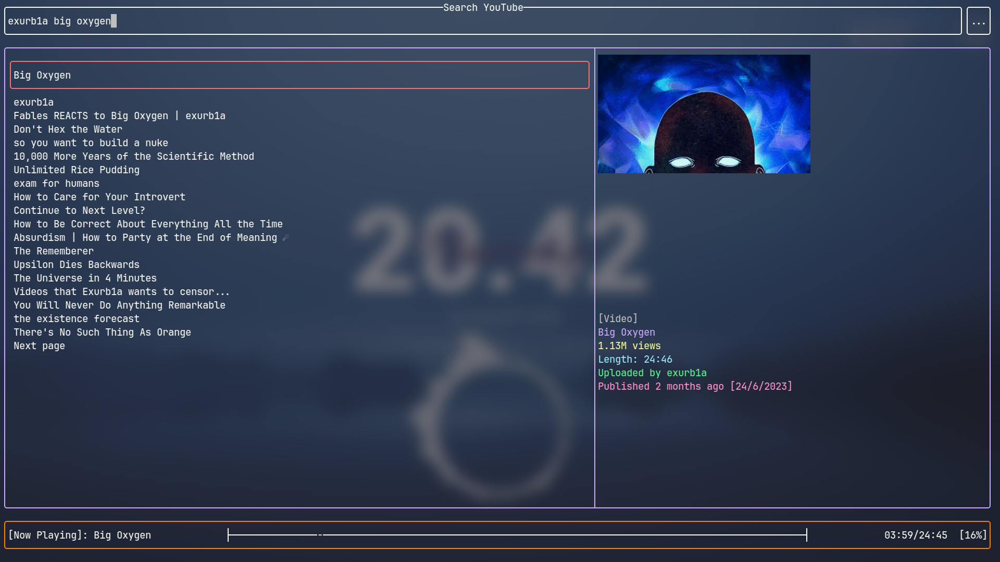
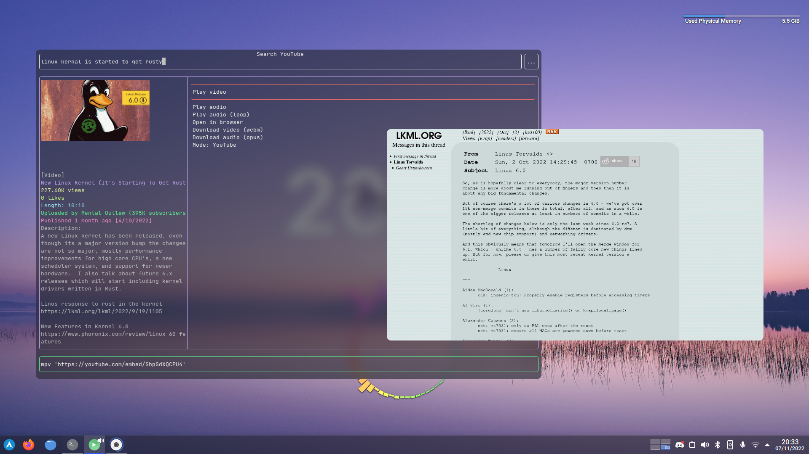

[](https://crates.io/crates/youtube-tui)
[](https://crates.io/crates/youtube-tui)
[](https://aur.archlinux.org/packages/youtube-tui)


# Overview

Written in Rust, the **YouTube TUI** is a lightweight and user friendly TUI for browsing YouTube content from the terminal.



It is like an _app launcher_, it launches other programs to do the heavy lifting (for example, `mpv` for playing videos).

> Consider regenerating config files on updates to allow new features.

## Customisable

The YouTube TUI can be customised through config files, they are located in `~/.config/youtube-tui` and are in the YAML format.

Here's an example of the config file:

```yaml
mouse_support: true
invidious_instance: https://vid.puffyan.us
max_watch_history: 50
allow_unicode: false
images: Sixels
refresh_after_modifying_search_filters: true
provider: YouTube
env:
  browser: firefox
  video-player: mpv
  youtube-downloader: yt-dlp
  terminal-emulator: konsole -e
```

Anything from layouts to colours and keybindings can be customised, more on that later.

## Dependency-free*

<sub>See [installation#features](https://siriusmart.github.io/youtube-tui/installation.html#features) for more info on dependencies.</sub>

The YouTube TUI does not work on its own, it is instead like a _TUI frontend_ for programs like `mpv` or `yt-dlp`/`youtube-dl`.

However, the programs to launch can be changed, and therefore the YouTube TUI <u>does not rely on any specific dependencies</u> to run.



## Powerful

The YouTube TUI allows you to browse YouTube with (almost) all of it's features, functions including:

- View popular/trending videos
- View information about channels, playlists and videos
- Use search filters to sort and filter search results
- Save browsing history

It also includes features like:

- Vim-like commands
- Mouse support
- Extensible keybindings system
- Offline library

### What it doesn't have

- Subscriptions (first priority)
- Clipboard feature that does not depend on the `clipboard` feature
- Up arrow command history + Ctrl arrow keys move between words

## How to contribute

You will need a <u>general knowledge</u> of the Rust programming language, and the ability to _understand my spaghetti_.

1. Open an issue to make sure nobody else is working on the same feature
2. Write code
3. Open a pull request
4. Get merged?

Or just _fix that typo in README_ -\_-
