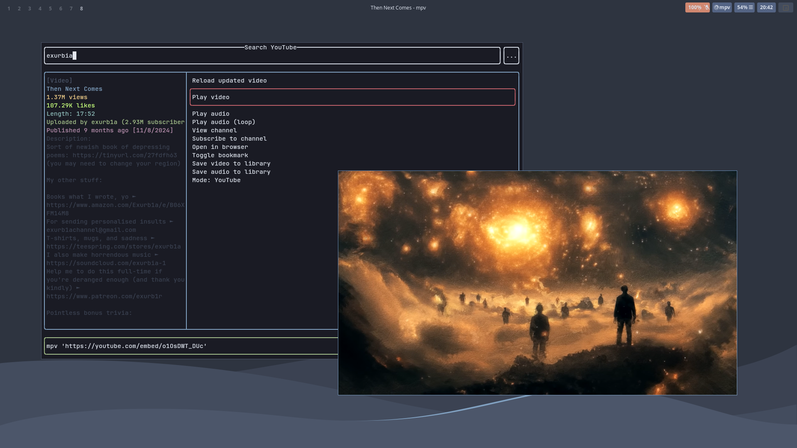
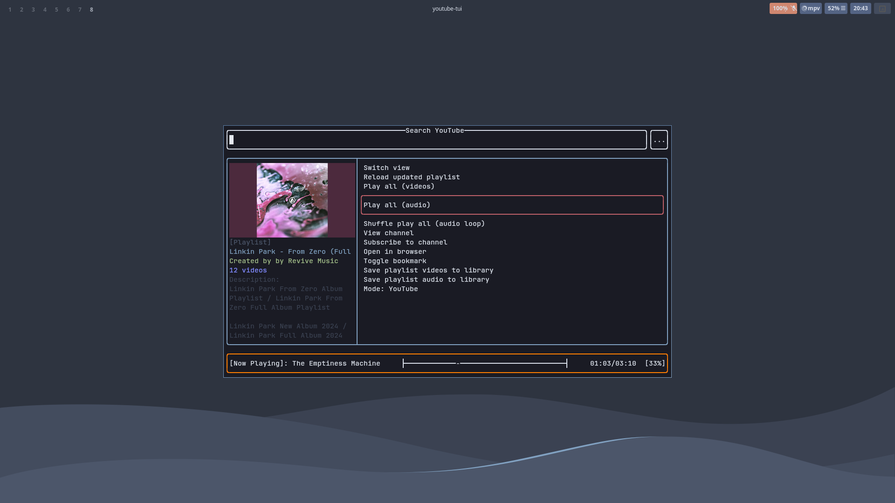
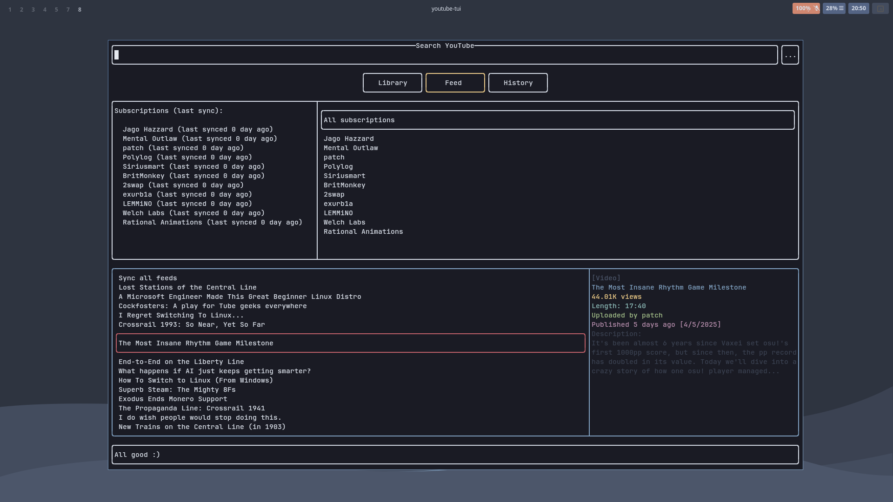

# Overview

Written in Rust, the **YouTube TUI** is a lightweight and user friendly TUI for browsing YouTube content from the terminal. Works out of the box and easily configurable.



It is like an _app launcher_, it launches other programs to do the heavy lifting (for example, `mpv` for playing videos).

<sub>It also have an embedded mpv music player, but that can be disabled in compile time.</sub>

> Consider regenerating config files on updates to allow new features.

## Customisable

The YouTube TUI can be customised through config files, they are located in `~/.config/youtube-tui` and are in the YAML format.

Here's an example of the config file:

```yaml
mouse_support: true
max_watch_history: 50
allow_unicode: false
images: Sixels
refresh_after_modifying_search_filters: true
provider: YouTube
env:
  browser: firefox
  video-player: mpv
  youtube-downloader: yt-dlp
  terminal-emulator: konsole -e
```

Anything from layouts to colours and keybindings can be customised, more on that later.

## Dependency-free*

<sub>See [installation#features](https://tui.siri.ws/youtube/installation.html#features) for more info on dependencies.</sub>

The YouTube TUI does not work on its own, it is instead like a _TUI frontend_ for programs like `mpv` or `yt-dlp`/`youtube-dl`.

However, the programs to launch can be changed, and therefore the YouTube TUI <u>does not rely on any specific dependencies</u> to run.



## Powerful

The YouTube TUI allows you to browse YouTube with (almost) all of it's features, functions including:

- View information about channels, playlists and videos
- Use search filters to sort and filter search results
- Save browsing history
- Embedded audio/music player



It also includes features like:

- Vim-like commands
- Mouse support
- Extensible keybindings system
- Offline library
- Subscriptions

### TODO

- [URGENT] Replace the no-longer-going-to-compile `typemap` dependency with either a self implementation of it or a useable crate.
> This has been urgent for over 2 years now, maybe the deprecation warnings aren't real, nothing ever happens.
- Git like command line to improve on `yt-dlp` - make changes to existing downloaded playlists instead of redownloading the entire thing.
- Channel caching and bookmarking.
- Selecting item on channel list moves focus to feed items.

## How to contribute

You will need a <u>general knowledge</u> of the Rust programming language, and the ability to _understand my spaghetti_.

1. Open an issue to make sure nobody else is working on the same feature
2. Write code
3. Open a pull request
4. Get merged?

Or just _fix that typo in README_ -\_-
