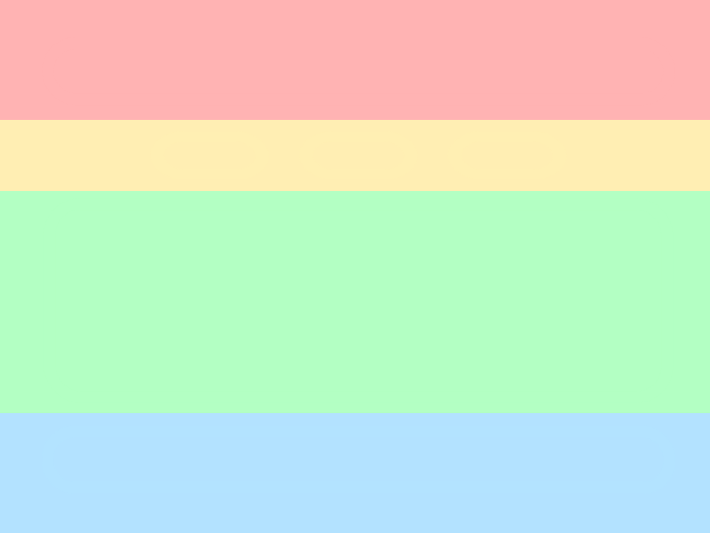

# Framework

At the core of this TUI, is the framework from the <a href="https://crates.io/crates/tui-additions" target=_blank>`tui-additions`</a> crate, it allows the program to *render* onto the screen, *take inputs* (mouse and keyboard) in an orderly fashion.

## Items

Items are placed across the screen *in rows*, each item is <u>individual</u> and changing of one should not affect others in anyway.

Each item has a set of funcitons (from the trait `FrameworkItem`), or handlers.

|Function|Return type|Purpose|
|---|---|---|
|`selectable`|Boolean|Check if the item can be selected, and should the user be able to hover the cursor over the item.  (E.g. Message bar is not selectable)|
|`render`|None|The item renders itself within a given area of the screen.|
|`key_event`|Result|The item handles the keyboard input when it is selected, if an `Err(_)` is returned then the error will be displayed in the message bar.|
|`mouse_event`|Boolean|The selected item handles the mouse click event when being clicked on.|

Todo...

